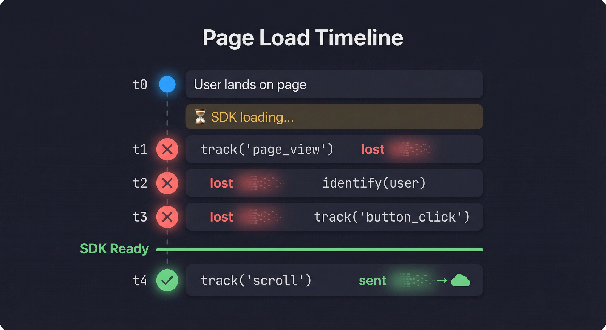
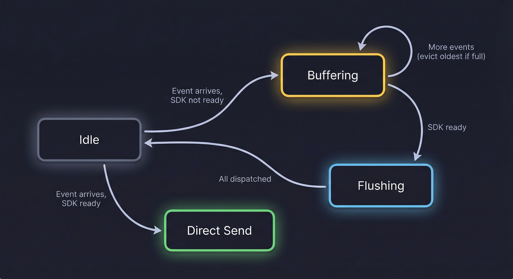

## What Is Buffering?

At its core, buffering is one of the oldest ideas in computing: **don't send data until the receiver is ready to handle it**. Instead of dropping what can't be processed immediately, you hold it in a temporary storage area — a buffer — and release it when the time is right.

The concept is everywhere. When you stream a video, your browser downloads chunks ahead of playback and holds them in a buffer so the video doesn't stutter every time the network hiccups. When you type on a keyboard, keystrokes are buffered so no character is lost, even if the CPU is momentarily busy.

The pattern appears across every layer of a modern system:

| Domain                | What's Buffered | Why                                                             |
| --------------------- | --------------- | --------------------------------------------------------------- |
| **Networking (TCP)**  | Packets         | Handles varying transmission speeds between sender and receiver |
| **Operating Systems** | I/O operations  | Batches disk reads/writes to reduce expensive system calls      |
| **Video Streaming**   | Media frames    | Absorbs network jitter so playback remains smooth               |
| **Keyboard Input**    | Keystrokes      | Ensures no input is lost while the CPU handles other tasks      |
| **Database Writes**   | Transactions    | Groups multiple writes into a single flush for performance      |

In every case, the idea is the same: **data arrives before something is ready to handle it, and a buffer holds onto it until it is**.

### Why Buffering Matters

Buffering provides three core benefits:

1. **Reliability** — No data is lost while the receiver is unavailable.
2. **Decoupling** — The sender doesn't need to wait for the receiver to be ready.
3. **Performance** — Items can be processed in batches instead of one at a time.

The tradeoff is **memory**. If the receiver never catches up, the buffer grows without bound — which is why well-designed buffers have **size limits** and **eviction policies**.

---

## The Problem in Analytics

In any web application, third-party scripts load **asynchronously**. There is always a gap between the moment a user starts interacting with a page and the moment the analytics SDK finishes initializing. Events fired during that gap — page views, clicks, form submissions — are silently lost.

This is the timeline of a typical page load:




Everything before the SDK is ready is gone. For analytics, this means **missing attribution data, and unreliable metrics**.

---

## The Solution: An Event Buffer

A buffer sits between your application code and the analytics SDK. It intercepts every event call and makes a simple decision:

- **SDK ready?** → send the event directly.
- **SDK not ready?** → hold the event in a queue and send it later.

The core routing logic looks like this:

```javascript
function sendOrBufferEvent(method,args){

    if (isSDKReady()) {
      try {
        analytics[method](...args);
      } catch (err) {
        bufferEvent(method,args);
      }
    } else {
      bufferEvent(method,args);
    }
};
```
> Notice the `try/catch` — even when the SDK reports itself as ready, a call can still fail. The buffer acts as a safety net in that case too.

---

## Key Design Decisions

### 1. Fixed-Size Buffer with Eviction

An unbounded queue is dangerous in the browser. If the SDK never loads, the buffer grows indefinitely, consuming memory. A fixed-size buffer with oldest-first eviction solves this:

```javascript
const BUFFER_CONFIG = {
    MAX_BUFFER_SIZE: 10,
    FLUSH_TIMEOUT: 60000
};

function bufferEvent(method,args){
    if (eventBuffer.length >= BUFFER_CONFIG.MAX_BUFFER_SIZE) {
      eventBuffer.shift(); // evict the oldest event
    }
    eventBuffer.push({method,args});
};
```

This creates a **sliding window** — the buffer always holds the most recent events. Older events are sacrificed to keep memory bounded. The assumption is that recent interactions are more valuable than stale ones.

### 2. Dual Flush Triggers

The buffer is flushed in two scenarios:

| Trigger            | When                           | Purpose                                       |
| ------------------ | ------------------------------ | --------------------------------------------- |
| **Ready callback** | SDK signals it has initialized | Primary — the happy path                      |
| **Timeout (60s)**  | Fixed duration after page load | Fallback — in case the callback is unreliable |

```javascript
function setupReadyListener(){
    // Primary: listen for the SDK's ready signal
    analytics.ready(() => {
        markAsReady();
      },
    );

    // Fallback: try flushing after a timeout
    setTimeout(
      () => {
        if (eventBuffer.length > 0 && isSDKReady()) {
          flushBuffer();
        }
      },
      FLUSH_TIMEOUT,
    );
  };
```

The timeout does **not** force a flush blindly — it checks whether the SDK is actually ready before dispatching. This prevents sending events into a half-initialized system.

### 3. One-Way Ready State

Once the SDK is marked as ready, it stays ready. The `markAsReady` function is idempotent — calling it multiple times has no effect:

```javascript
function markAsReady() {
    if (_isReady)
      return; // already marked

    _isReady = true;
    clearTimeout(flushTimeout);
    flushBuffer();
};
```

This avoids duplicate flushes and ensures the timeout is cleaned up the moment the primary trigger fires.

### 4. Readiness Check

A simple boolean flag is not enough. True readiness means the SDK object exists **and** exposes the methods we need:

```javascript
function isSDKReady() {
    return (
      typeof window !== "undefined" &&
      window.analytics &&
      _isReady &&
      typeof window.analytics.track === "function" &&
      typeof window.analytics.identify === "function"
    );
};
```

This guards against edge cases where the SDK script is loaded but not fully initialized, or where a different script has overwritten the global.

---

## The Flush

When the buffer flushes, every queued event is dispatched and the queue is emptied:

```javascript
async function flushBuffer() {
    if (eventBuffer.length === 0)
      return;

    const promises = eventBuffer.map((event) => {
          return new Promise(
            (resolve) => {
              try {
                analytics[event.method](...event.args);
                resolve({ success: true});
                
              } catch (error) {
                resolve({success: false,error});
              }
            },
          );
        },
      );

    await Promise.allSettled(promises);
    
    // Clear the buffer
    eventBuffer.length = 0;
};
```
> Note: **`Promise.allSettled`** instead of `Promise.all` — one failing event does not block the rest.

---

## Lifecycle at a Glance

The buffer moves through four states:

| State           | Description                                     |
| --------------- | ----------------------------------------------- |
| **Idle**        | No events queued, waiting for activity          |
| **Buffering**   | SDK not ready, events are being queued          |
| **Flushing**    | SDK became ready, Sending (dispatching) all queued events |
| **Direct Send** | SDK is ready, events bypass the buffer entirely |



---

## Public API

The setup module exposes only three functions — everything else is internal:

| Function                          | Purpose                                               |
| --------------------------------- | ----------------------------------------------------- |
| `sendOrBufferEvent(method, args)` | Route an event: send immediately or queue             |
| `setupReadyListener()`            | Register the SDK ready callback and start the timeout |
| `isSDKReady()`                    | Check whether the SDK is fully initialized            |

This minimal surface area makes the buffer easy to integrate and hard to misuse.

---

## When to Use This Pattern

Data buffering is useful whenever:

- A **third-party SDK loads asynchronously** and you need to capture events before it's ready.
- You want **zero event loss** during the initialization window without blocking the main thread.
- You need a **predictable memory footprint** — the fixed-size buffer prevents unbounded growth.
- You want a **fallback mechanism** in case the SDK's ready signal is delayed or never fires.

This pattern is **not** specific to analytics — it works anywhere data arrives before something is ready to process it.

---

## Tradeoffs

| Advantage                        | Limitation                                                               |
| -------------------------------- | ------------------------------------------------------------------------ |
| Zero event loss during SDK load  | Oldest events are dropped if buffer overflows                            |
| Bounded memory usage             | Fixed capacity means some data loss under heavy load                     |
| Timeout fallback for reliability | Events stay in buffer forever if SDK never loads and timeout check fails |
| Simple, stateless API            | No persistence — a page refresh clears the buffer                        |
| Graceful error handling          | Failed events during flush are not retried                               |

---

## Summary

A small buffer removes the guesswork around SDK timing. Your app fires events freely, and the buffer makes sure nothing is lost. The entire implementation is just a fixed-size array, a ready flag, and a few functions.
