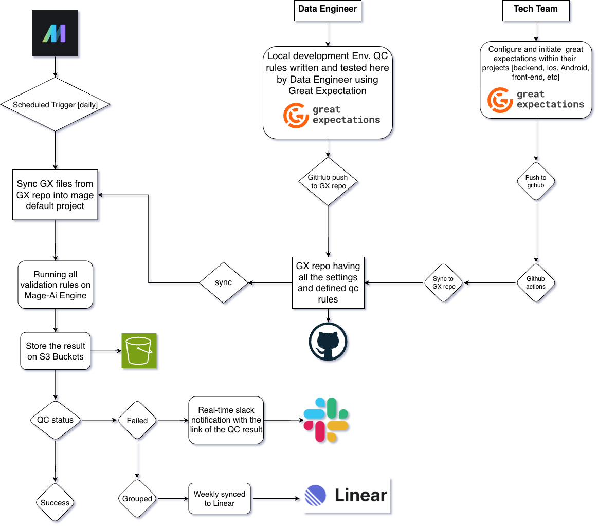

# End-to-End Data Quality Architecture: Great Expectations, GitHub, S3, Slack, and Linear — From Validation to Resolution

*A production reference architecture that doesn't just catch data issues — it routes them to the right team, in the right tool, automatically.*

---

---

## The Gap Most Data Quality Systems Leave Open

Most data quality setups solve the detection problem. A tool runs checks against a warehouse, flags failures, and maybe posts a message to Slack. But detection without resolution is just noise.

The real question isn't "did the data fail a check?" — it's "who fixes it, when, and how do we know it got fixed?"

This article describes a complete architecture that closes that gap. It covers the full lifecycle of a data quality issue: from rule creation, through automated validation, to durable storage, real-time alerting, and — critically — **automatic issue creation in a project tracker so failures become assigned, tracked, prioritized work.**

The system runs daily, costs nearly nothing, requires no dedicated infrastructure, and scales from a single data engineer to a multi-team organization where backend, mobile, and frontend teams all contribute validation rules to a shared pipeline.

---

## Design Principles

Before the boxes and arrows, three principles that shaped every decision:

**1. Git is the only source of truth.**
Validation rules, checkpoint configurations, datasource definitions — everything lives in a GitHub repository. There's no configuration stored in an orchestrator UI, no rules defined in a dashboard, no implicit state anywhere. If the repo is deleted, the system is rebuilt from a fresh clone in minutes.

**2. Failures must become work, not messages.**
A Slack notification is a signal. A Linear issue with an owner, a priority, and a due date is work. The architecture treats issue creation as a first-class pipeline stage, not an afterthought.

**3. Contributors shouldn't need to learn the platform.**
Product teams — backend, iOS, Android, web — should be able to write validation rules in their own repos using their own workflows. They shouldn't need access to the orchestrator, the data warehouse credentials, or even the main GX repository. The system pulls their contributions in automatically.

---

## Architecture Overview

The system has six layers, each with a single responsibility:

```
LAYER 1: CONTRIBUTION
┌──────────────────┐                    ┌──────────────────┐
│  Data Engineer   │                    │  Product Teams   │
│  (writes rules   │                    │  (write rules in │
│   in main repo)  │                    │   their own repos)│
└────────┬─────────┘                    └────────┬─────────┘
         │ git push                    git push  │
         │                                       │
         ▼                                       ▼
LAYER 2: SOURCE OF TRUTH              GitHub Actions auto-sync
┌────────────────────────────────────────────────┐
│         GX Repository (GitHub)                 │
│         Single repo, all rules, all teams      │
└────────────────────┬───────────────────────────┘
                     │
LAYER 3: EXECUTION   │  scheduled trigger (daily)
┌────────────────────┴───────────────────────────┐
│         Orchestrator Pipeline                  │
│         Sync → Initialize → Run Checkpoints    │
└──────┬─────────────┬───────────────┬───────────┘
       │             │               │
LAYER 4: DATA        │     LAYER 5: STORAGE      
┌──────┴──────┐  ┌───┴────────┐                  
│  ClickHouse │  │     S3     │                  
│  (read-only)│  │  (results  │                  
└─────────────┘  │  + docs)   │                  
                 └────────────┘                  

LAYER 6: RESOLUTION
┌────────────────────────────────────────────────┐
│  QC Status Decision                            │
│  ├─ Pass → done, no action                     │
│  └─ Fail → Slack alert + Linear issue created  │
│            (categorized by team, auto-assigned) │
└────────────────────────────────────────────────┘
```

Each layer can be swapped independently. Replace ClickHouse with Snowflake, Slack with Teams, Linear with Jira, the orchestrator with GitHub Actions — the architecture stays the same because the contracts between layers are simple: git URLs, environment variables, S3 paths, and webhook URLs.

---

## Layer 1: The Contribution Model

### The Problem

In most organizations, data engineers aren't the only people who understand the data. The backend team knows the order schema. The mobile team knows the event taxonomy. The frontend team knows the tracking payload structure.

But if only data engineers can write validation rules, you get a bottleneck: the data team becomes the single point of failure for every data quality definition across the entire company. Rules get written late, reviewed slowly, and maintained by people who didn't write them.

### The Solution: Dual-Contributor Workflow

Two paths feed the same system:

**Path A — Data Engineers** work directly in the main GX repository. They own warehouse-level validations: row counts, freshness, referential integrity, cross-table invariants, and schema drift detection. They push to `main`, and the next scheduled run picks up their changes.

**Path B — Product Teams** work in their own repositories. Each team (backend, iOS, Android, web) has a lightweight GX project in their own codebase. They write and test expectations against their own data using their own development workflows — no new tools, no new access requests, no new repos to learn.

When a product team pushes changes to their GX directory, a GitHub Action automatically opens a pull request against the main GX repository. The sync copies expectations and checkpoint files, patches the datasource configuration to include new assets, and creates the PR for data engineering to review.

This gives data engineering a **review gate** without creating a **contribution bottleneck**. Product teams iterate at their own pace; merges to the main repo happen on whatever cadence makes sense.

### Why This Matters

Without a dual-contributor model, data quality coverage is limited to whatever the data team has time to write. With it, coverage scales with the number of teams who care about their own data — which, in practice, is all of them once the barrier to contribution is low enough.

---

## Layer 2: The GX Repository as Source of Truth

The repository holds everything the system needs to run:

- **Expectations** — the individual validation rules (column not null, value within range, row count above threshold)
- **Checkpoints** — named collections of expectations that run together as a unit
- **Validation Definitions** — the binding between a checkpoint, a data source, and a batching strategy
- **Configuration** — datasource connection strings (as environment variable references, never plaintext), S3 store settings, Slack webhook references
- **Sync workflows** — GitHub Actions that pull contributions from product team repos

Secrets never enter the repository. The configuration file references variables like `${WAREHOUSE_CONNECTION_STRING}` and `${AWS_ACCESS_KEY_ID}`, which are resolved at runtime from the orchestrator's secret manager. This means the same GX project can run against staging or production by swapping a single set of environment variables — no code changes, no branch switching, no config files to maintain per environment.

### Naming Convention as Architecture

Checkpoint names carry metadata that powers the entire downstream resolution pipeline. The convention is simple:

```
<platform>_<domain>_<check_type>_suite
```

Examples: `ios_identify_last_24h_validation_suite`, `backend_orders_totals_suite`, `web_pageview_schema_suite`, `android_tracking_freshness_suite`.

This isn't cosmetic. The platform prefix — `ios_`, `backend_`, `web_`, `android_` — is what the resolution layer uses to categorize failures and route them to the right team in Linear. Without this convention, routing failures requires manual triage. With it, routing is automatic.

---

## Layer 3: The Execution Pipeline

The orchestrator runs a three-stage pipeline on a daily schedule:

**Stage 1: Sync.** Pull the latest version of the GX repository into the runtime environment. If the repo already exists locally, this is a fast `git pull`; if not, a shallow clone. Either way, under 10 seconds.

**Stage 2: Initialize.** Create the Great Expectations context, inject secrets from the orchestrator's secret manager as environment variables, and verify connectivity to the warehouse and S3.

**Stage 3: Run.** Execute every checkpoint in the project, collect results, store them to S3, build data docs, and return a structured summary of passes and failures.

The pipeline is deliberately thin. It contains no business logic, no conditional branching, no retry logic beyond what GX provides natively. Its only job is to pull, initialize, run, and report. All the intelligence — what to check, how to check it, what constitutes a failure — lives in the GX project itself, versioned in git.

### Orchestrator Choice

This pipeline is simple enough to run on almost anything: MageAI, Airflow, Prefect, Dagster, GitHub Actions, or even a cron job on a single server. The architecture doesn't depend on the orchestrator's features because it doesn't use them beyond three things: scheduling, logging, and secrets.

For teams that want to minimize cost and operational overhead, **GitHub Actions** is a strong default — it runs directly from the GX repository, uses GitHub's built-in secrets manager, costs fractions of a cent per run, and requires no infrastructure to manage. For teams that already have an orchestrator running other data pipelines, adding GX as one more pipeline keeps the operational surface smaller.

The key insight is that the orchestrator is **interchangeable**. If your current tool becomes expensive, slow, or end-of-life, the migration is swapping three pipeline stages — not rebuilding the validation system.

---

## Layer 4: Storage and Data Docs

### S3 as the System of Record

Every validation run writes three things to S3:

- **Validation results** — the full JSON output of each checkpoint, stored under a timestamped prefix. This is the forensic record: what was checked, what passed, what failed, and why.
- **Data docs** — a rendered HTML site that GX builds automatically from validation results. Browsable in any web browser, linkable from Slack messages and Linear issues.
- **Run metadata** — a lightweight summary (total checkpoints, pass/fail counts, duration) for long-term trending without re-scanning every result file.

S3 lifecycle rules keep costs under control: results older than 90 days move to cold storage or get deleted. Without this, a year of daily runs across 60 checkpoints produces tens of thousands of small JSON files, and the data docs build slows to a crawl.

### Why Not a Database?

Validation results are write-once, read-rarely data. They're useful during incident investigation and for long-term trend analysis, but they're not queried in real-time. S3 is cheaper, simpler, and more durable than a database for this access pattern. If you later want to query results analytically, a scheduled job that loads the daily summary into a warehouse table gives you the best of both worlds without complicating the primary storage layer.

---

## Layer 5: Real-Time Alerting via Slack

Slack is the fast path — the "something broke right now" signal. The design follows two rules:

**Rule 1: Alert on failure only.** A daily "all 60 checkpoints passed" message is noise within a week. The channel should be silent when things are healthy, and loud when they're not. Silence becomes a signal of its own — if the channel is quiet, things are working.

**Rule 2: Link, don't inline.** A Slack message should tell you *what* failed and *where to look*. The full validation details live in S3 data docs; the Slack message contains a link, not a payload. This keeps messages scannable and avoids the wall-of-text problem that makes people mute the channel.

A typical failure alert:

```
🚨 Data Quality Alert
3 of 60 checkpoints failed.

Failed:
• ios_identify_last_24h_validation_suite
• backend_orders_totals_suite
• web_pageview_schema_suite

Data Docs: https://gx-bucket.s3.amazonaws.com/data_docs/index.html
```

Three lines of signal, one link to context. Anyone in the channel can see what broke at a glance and drill in if they need to.

But here's the problem Slack doesn't solve: **who acts on it?** A message in a shared channel is everyone's responsibility, which means it's no one's responsibility. That's where Linear comes in.

---

## Layer 6: Automatic Issue Creation in Linear

This is the layer that transforms the system from "monitoring" to "operations." Without it, failures sit in Slack until someone decides to act. With it, failures become tracked, assigned, prioritized issues in the tool teams already use to manage their work.

### The Resolution Pipeline

A separate pipeline — distinct from the main validation pipeline — runs after each validation cycle and handles the failure-to-issue conversion. It has three stages:

**Stage 1: Load failures.** Read the latest run metadata from S3 and filter to checkpoints that failed.

**Stage 2: Categorize.** Using the checkpoint naming convention (`ios_`, `backend_`, `web_`, etc.), group failures by the team responsible for the data source. Failures that don't match any known prefix go into an `other` category for manual triage by the data team.

**Stage 3: Create issues.** For each failure, create a Linear issue via their GraphQL API with:

- **Title** drawn from the checkpoint name and failure summary
- **Team** determined by the category (each platform maps to a Linear team ID)
- **Priority** set based on severity — a freshness check failure is lower priority than a null primary key
- **Description** containing the failure details and a direct link to the S3 data docs for that specific checkpoint result
- **Labels** for filtering (`data-quality`, the platform name, the environment)

### Why the Tracker Matters More Than the Alert

A Slack message has a half-life of about two hours. By the next morning, it's buried under stand-up threads, deployment notifications, and memes. Even with a dedicated `#data-quality-alerts` channel, messages older than a day are functionally invisible.

A Linear issue, on the other hand, sits in a team's backlog until someone explicitly closes it. It shows up in sprint planning. It can be prioritized against feature work. It has an owner, a status, and a history.

**Data quality issues that live in chat get forgotten. Data quality issues that live in the backlog get fixed.** That's the entire argument for this layer.

### Deduplication

A naive implementation creates a new issue every time a checkpoint fails, including repeated failures for the same underlying problem. The resolution pipeline handles this by checking for an existing open issue with the same checkpoint name before creating a new one. If an issue already exists and is open, the pipeline appends a comment with the latest failure timestamp instead of creating a duplicate.

This means persistent failures produce a single issue with a growing comment thread — each comment serving as evidence that the problem is ongoing — rather than a flood of identical tickets that train teams to ignore them.

### Closing the Loop

When a team fixes the underlying data issue and the checkpoint starts passing again, the resolution pipeline detects the transition from fail to pass. It posts a "resolved" comment on the corresponding Linear issue, giving the team confidence that their fix landed.

The full lifecycle:

```
Checkpoint fails
    → Slack alert posted (fast signal)
    → Linear issue created, assigned to owning team (durable work item)
    → Team investigates using S3 data docs link
    → Team ships a fix
    → Next validation run passes
    → Linear issue gets "resolved" comment
    → Team closes the issue
```

No manual triage. No "who owns this?" conversations. No failures that fall through the cracks because the Slack message scrolled off-screen.

### Tracker Flexibility

Linear is used here because its GraphQL API is clean, its team-based organization maps directly to the categorization model, and issue creation is a single mutation with no required workflow configuration. But the architecture is tracker-agnostic. The resolution pipeline's categorize-and-create logic doesn't change between trackers — the only tracker-specific piece is the API call itself. Swapping Linear for Jira, GitHub Issues, or Asana means rewriting one function, not redesigning the pipeline.

---

## Cost Profile

One of the strongest arguments for this architecture is how little it costs to run:

| Component | Monthly cost |
|---|---|
| GitHub Actions (runner) | ~$0 (free tier covers most setups) |
| S3 storage (results + docs) | ~$0.50 – $2.00 |
| Slack (existing workspace) | $0 |
| Linear (existing subscription) | $0 |
| Warehouse (read-only queries) | Marginal — runs against existing infra |
| **Total** | **~$1 – $2/month** |


The architecture achieves its low cost by not introducing any new infrastructure. It runs on CI runners you already pay for, stores results in an S3 bucket, posts to a Slack workspace, and creates issues in a tracker — all services that are already part of the stack. The marginal cost of adding data quality validation to an organization that already uses these tools is effectively zero.

---

## Maintainability

### What Needs Attention

- **Expectation suites need ownership.** A validation written by someone who left the team will eventually flag legitimate data as failures because the rules no longer match reality. An `owner` field in the checkpoint metadata — even just a team name — is enough to route maintenance back to someone. The Linear integration helps here: stale rules produce recurring issues that naturally surface during sprint planning.

- **S3 lifecycle rules need to exist from day one.** Adding them retroactively to a bucket with 100,000 files is tedious. Set them up during initial configuration.

- **Alert fatigue is a design failure, not an operational one.** If a checkpoint fails every day for a week and nobody acts, the system has a problem — but the problem isn't the alerting, it's either a flaky rule that should be fixed or a real issue that nobody has prioritized. The Linear integration makes this visible: an open issue with seven daily "still failing" comments is hard to ignore.

### What Doesn't Need Attention

- **The orchestrator pipeline** is three stages with no business logic. It doesn't change unless GX itself changes its API.
- **The sync workflow** is a generic file-copy action. It doesn't change unless the repository structure changes.
- **The resolution pipeline** is a read-categorize-create loop. It doesn't change unless you add new platform prefixes or switch trackers.

The system is boring by design. Most days, it runs silently, passes all checkpoints, and produces no output. On the days it catches something, the failure flows through six layers and arrives as a prioritized issue on the right team's board without anyone lifting a finger.

---

## Impact

The measurable outcomes of running this architecture in production:

- **Detection coverage** scales with the number of contributing teams, not the capacity of the data team alone
- **Mean time to resolution** drops because failures arrive as assigned work in the team's own tracker, not ambient notifications in a shared channel
- **Cost of operation** stays under $5/month regardless of checkpoint count
- **Onboarding time** for new contributing teams is under an hour
- **False positive rate** stays manageable because ownership is explicit and stale rules surface naturally through the issue tracker
- **Audit trail** is complete and durable — every validation result lives in S3 with the exact expectations that produced it, versioned in the same git history as the code that generated the data

The architecture doesn't just catch data quality issues. It makes them **impossible to ignore, expensive to defer, and easy to fix** — which, in the end, is the only thing that matters.

---